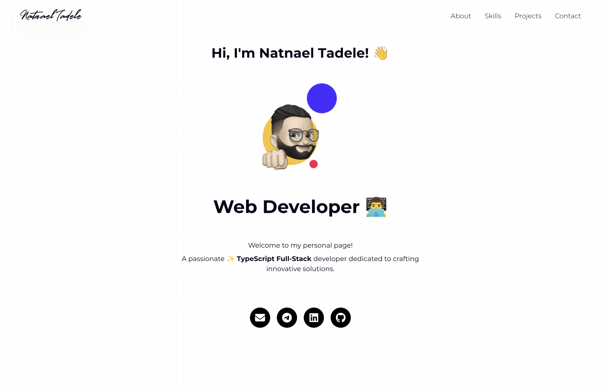

# Natnael Tadele's Portfolio Website

Personal portfolio website showcasing my skills, projects, and contact information.

## 🚀 Technologies Used

- **Next.js 14**: React framework for server-side rendering and static site generation
- **TypeScript**: For type-safe JavaScript
- **Tailwind CSS**: Utility-first CSS framework for styling
- **Framer Motion**: For animations and transitions
- **Lottie**: For interactive animations
- **FontAwesome**: For icons

## 📋 Features

- Responsive design for all device sizes
- Modern UI with smooth animations
- Project showcase
- Skills section
- Contact information
- Social media links

## 🛠️ Installation

```bash
# Clone the repository
git clone https://github.com/yourusername/natnael-portfolio-website.git

# Navigate to the project directory
cd natnael-portfolio-website

# Install dependencies
pnpm install

# Run the development server
pnpm dev
```

Open [http://localhost:3000](http://localhost:3000) in your browser to see the result.

## 📸 Screenshot



## 🏗️ Project Structure

```
/
├── public/          # Static assets
├── src/             # Source code
│   ├── app/         # Next.js app directory
│   ├── components/  # React components
│   ├── lib/         # Utility functions
│   └── styles/      # Global styles
├── tailwind.config.js # Tailwind configuration
└── next.config.js   # Next.js configuration
```

## 📝 License

MIT

## 👤 Author

**Natnael Tadele**

- Website: [natnaeltadele.com](https://natnaeltadele.com)
- GitHub: [@your-github-username](https://github.com/your-github-username)
- LinkedIn: [Natnael Tadele](https://linkedin.com/in/your-linkedin-username)
